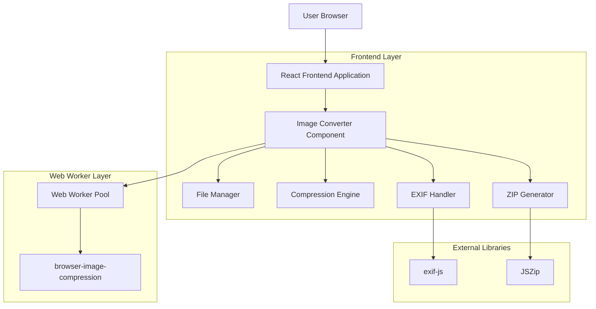

# Image Converter Tool - Technical Architecture Document

## 1. Architecture Design



## 2. Technology Description

- **Frontend**: React@18 + TypeScript + Tailwind CSS + shadcn/ui
- **Image Processing**: browser-image-compression@2.0.2
- **EXIF Handling**: exif-js@2.3.0
- **ZIP Generation**: jszip@3.10.1
- **File Download**: file-saver@2.0.5
- **Performance**: Web Workers API
- **UI Components**: Custom drag-drop zone, progress bars, thumbnails

## 3. Component Structure

### 3.1 Main Components

```typescript
// Component hierarchy
ImageConverter/
├── ImageConverterMain.tsx          // Main container
├── components/
│   ├── DropZone.tsx               // Drag & drop file upload
│   ├── FileList.tsx               // Display uploaded files
│   ├── FileItem.tsx               // Individual file item with preview
│   ├── SettingsPanel.tsx          // Conversion settings
│   ├── ProgressTracker.tsx        // Progress visualization
│   ├── BatchControls.tsx          // Batch operation controls
│   └── DownloadManager.tsx        // Download and ZIP handling
├── workers/
│   └── imageProcessor.worker.ts   // Web worker for image processing
├── utils/
│   ├── imageUtils.ts              // Image processing utilities
│   ├── exifUtils.ts               // EXIF metadata handling
│   ├── zipUtils.ts                // ZIP file generation
│   └── fileUtils.ts               // File handling utilities
└── types/
    └── imageConverter.types.ts     // TypeScript type definitions
```

### 3.2 Core Types

```typescript
interface ImageFile {
  id: string;
  file: File;
  name: string;
  size: number;
  type: string;
  preview: string;
  status: 'pending' | 'processing' | 'completed' | 'error';
  progress: number;
  convertedFile?: Blob;
  error?: string;
}

interface ConversionSettings {
  outputFormat: 'webp' | 'jpeg' | 'png' | 'avif' | 'bmp' | 'tiff';
  quality: number; // 0.1 - 1.0
  maxWidth?: number;
  maxHeight?: number;
  preserveExif: boolean;
  renamePattern: string; // e.g., "{name}_{index}.{ext}"
}

interface ProcessingResult {
  success: boolean;
  file?: Blob;
  error?: string;
  originalSize: number;
  compressedSize: number;
  compressionRatio: number;
}
```

## 4. Core Features Implementation

### 4.1 Bulk Upload System

**Drag & Drop Zone**
- Support multiple file selection
- Visual feedback for drag states
- File type validation
- Size limit checking (max 50MB per file)
- Duplicate file detection

**File Input Fallback**
- Traditional file input for accessibility
- Multiple file attribute
- Accept specific MIME types

### 4.2 Image Processing Pipeline

**Web Worker Implementation**
```typescript
// imageProcessor.worker.ts
self.onmessage = async (event) => {
  const { file, settings, fileId } = event.data;
  
  try {
    // Step 1: Extract EXIF if needed
    const exifData = settings.preserveExif ? 
      await extractExif(file) : null;
    
    // Step 2: Compress and convert
    const compressedFile = await imageCompression(file, {
      maxSizeMB: settings.maxSizeMB,
      maxWidthOrHeight: Math.max(settings.maxWidth, settings.maxHeight),
      useWebWorker: false, // Already in worker
      fileType: `image/${settings.outputFormat}`,
      quality: settings.quality
    });
    
    // Step 3: Re-inject EXIF if preserved
    const finalFile = exifData ? 
      await injectExif(compressedFile, exifData) : compressedFile;
    
    // Step 4: Apply naming pattern
    const renamedFile = applyNamingPattern(finalFile, settings.renamePattern);
    
    self.postMessage({
      type: 'success',
      fileId,
      result: renamedFile,
      stats: {
        originalSize: file.size,
        compressedSize: renamedFile.size,
        compressionRatio: (1 - renamedFile.size / file.size) * 100
      }
    });
  } catch (error) {
    self.postMessage({
      type: 'error',
      fileId,
      error: error.message
    });
  }
};
```

### 4.3 EXIF Preservation

**EXIF Extraction**
```typescript
import EXIF from 'exif-js';

export const extractExif = (file: File): Promise<any> => {
  return new Promise((resolve) => {
    EXIF.getData(file, function() {
      const exifData = EXIF.getAllTags(this);
      resolve(exifData);
    });
  });
};

export const injectExif = async (file: Blob, exifData: any): Promise<Blob> => {
  // Implementation using piexifjs or similar library
  // to inject EXIF data back into processed image
};
```

### 4.4 Batch Download with ZIP

**ZIP Generation**
```typescript
import JSZip from 'jszip';
import { saveAs } from 'file-saver';

export const createZipDownload = async (files: ImageFile[]): Promise<void> => {
  const zip = new JSZip();
  
  // Add each converted file to ZIP
  files.forEach((imageFile) => {
    if (imageFile.convertedFile) {
      zip.file(imageFile.name, imageFile.convertedFile);
    }
  });
  
  // Generate ZIP blob
  const zipBlob = await zip.generateAsync({
    type: 'blob',
    compression: 'DEFLATE',
    compressionOptions: { level: 6 }
  });
  
  // Trigger download
  saveAs(zipBlob, `converted-images-${Date.now()}.zip`);
};
```

## 5. Performance Optimizations

### 5.1 Web Worker Pool

```typescript
class WorkerPool {
  private workers: Worker[] = [];
  private queue: ProcessingTask[] = [];
  private activeJobs = new Map<string, Worker>();
  
  constructor(poolSize: number = navigator.hardwareConcurrency || 4) {
    for (let i = 0; i < poolSize; i++) {
      this.workers.push(new Worker('/workers/imageProcessor.worker.js'));
    }
  }
  
  async processImage(file: File, settings: ConversionSettings): Promise<ProcessingResult> {
    return new Promise((resolve, reject) => {
      const task = { file, settings, resolve, reject, id: generateId() };
      
      const availableWorker = this.getAvailableWorker();
      if (availableWorker) {
        this.assignTask(availableWorker, task);
      } else {
        this.queue.push(task);
      }
    });
  }
}
```

### 5.2 Memory Management

- **Lazy Loading**: Load thumbnails only when visible
- **Object URL Cleanup**: Revoke blob URLs after use
- **Chunked Processing**: Process files in batches to prevent memory overflow
- **Progress Streaming**: Update UI progressively during processing

### 5.3 UI Optimizations

- **Virtual Scrolling**: For large file lists
- **Debounced Settings**: Prevent excessive re-processing
- **Optimistic Updates**: Show immediate feedback
- **Error Boundaries**: Graceful error handling

## 6. User Interface Design

### 6.1 Layout Structure

```
┌─────────────────────────────────────────────────────────┐
│                    Image Converter                      │
├─────────────────────────────────────────────────────────┤
│  ┌─────────────────┐  ┌─────────────────────────────┐   │
│  │   Settings      │  │      Drop Zone              │   │
│  │   Panel         │  │   "Drag files here or       │   │
│  │                 │  │    click to browse"         │   │
│  │ • Format        │  │                             │   │
│  │ • Quality       │  │   [Browse Files Button]     │   │
│  │ • Resize        │  └─────────────────────────────┘   │
│  │ • EXIF          │                                    │
│  │ • Rename        │  ┌─────────────────────────────┐   │
│  └─────────────────┘  │      File List              │   │
│                       │                             │   │
│  ┌─────────────────┐  │ [File1] [Progress] [Status] │   │
│  │ Batch Controls  │  │ [File2] [Progress] [Status] │   │
│  │                 │  │ [File3] [Progress] [Status] │   │
│  │ [Start All]     │  │                             │   │
│  │ [Clear All]     │  └─────────────────────────────┘   │
│  │ [Download ZIP]  │                                    │
│  └─────────────────┘  ┌─────────────────────────────┐   │
│                       │   Overall Progress          │   │
│                       │ ████████████░░░░░░░ 75%     │   │
│                       └─────────────────────────────┘   │
└─────────────────────────────────────────────────────────┘
```

### 6.2 Design Specifications

**Color Scheme**
- Primary: `hsl(221.2 83.2% 53.3%)` (Blue)
- Secondary: `hsl(210 40% 98%)` (Light Gray)
- Success: `hsl(142.1 76.2% 36.3%)` (Green)
- Warning: `hsl(47.9 95.8% 53.1%)` (Yellow)
- Error: `hsl(0 84.2% 60.2%)` (Red)

**Typography**
- Font Family: Inter, system-ui, sans-serif
- Headings: font-semibold, text-lg to text-2xl
- Body: font-normal, text-sm to text-base

**Components**
- Rounded corners: `rounded-lg` (8px)
- Shadows: `shadow-sm` for cards, `shadow-lg` for modals
- Spacing: Consistent 4px grid system
- Animations: Smooth transitions (200-300ms)

## 7. Implementation Plan

### Phase 1: Core Infrastructure (Week 1)
1. Set up component structure and types
2. Implement basic file upload and drag-drop
3. Create settings panel UI
4. Set up Web Worker infrastructure

### Phase 2: Image Processing (Week 2)
1. Integrate browser-image-compression
2. Implement format conversion logic
3. Add EXIF preservation functionality
4. Create progress tracking system

### Phase 3: Batch Operations (Week 3)
1. Implement worker pool for parallel processing
2. Add batch controls and queue management
3. Create ZIP download functionality
4. Implement file renaming patterns

### Phase 4: UI/UX Polish (Week 4)
1. Add thumbnails and preview functionality
2. Implement error handling and validation
3. Add responsive design and accessibility
4. Performance optimization and testing

## 8. Error Handling & Edge Cases

### 8.1 File Validation
- Unsupported file types
- Corrupted image files
- Files exceeding size limits
- Network interruptions during upload

### 8.2 Processing Errors
- Memory limitations
- Worker crashes
- Conversion failures
- EXIF extraction errors

### 8.3 User Experience
- Clear error messages
- Retry mechanisms
- Graceful degradation
- Progress persistence across page refreshes

## 9. Testing Strategy

### 9.1 Unit Tests
- Image processing utilities
- EXIF handling functions
- File validation logic
- ZIP generation

### 9.2 Integration Tests
- End-to-end conversion workflow
- Batch processing scenarios
- Error handling flows
- Performance benchmarks

### 9.3 Browser Compatibility
- Modern browsers (Chrome 90+, Firefox 88+, Safari 14+)
- Web Worker support verification
- File API compatibility
- Canvas API functionality

This technical architecture provides a comprehensive foundation for building a robust, performant Image Converter tool that meets all specified requirements while maintaining excellent user experience and code maintainability.