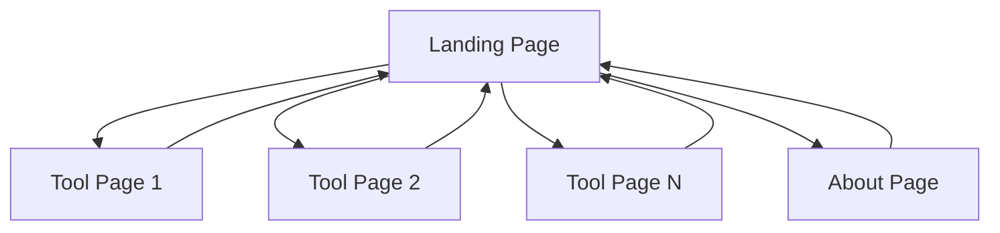

## 1. Product Overview
Webapp Tools Platform là một trang web tập hợp nhiều công cụ web client-side tiện ích, giúp người dùng truy cập và sử dụng các tools khác nhau từ một giao diện thống nhất.
- Mục tiêu chính: Tạo ra một nền tảng tập trung các webapp tools hữu ích, dễ sử dụng và có giao diện hiện đại.
- Giá trị thị trường: Tiết kiệm thời gian cho người dùng khi không cần tìm kiếm nhiều trang web khác nhau cho các công cụ cần thiết.

## 2. Core Features

### 2.1 User Roles
Không cần phân quyền người dùng phức tạp, tất cả người dùng đều có quyền truy cập đầy đủ các tools.

### 2.2 Feature Module
Dự án bao gồm các trang chính sau:
1. **Landing Page**: hero section, danh sách tools, navigation menu.
2. **Tool Pages**: giao diện riêng cho từng tool, breadcrumb navigation.
3. **About Page**: thông tin về platform, liên hệ.

### 2.3 Page Details

| Page Name | Module Name | Feature description |
|-----------|-------------|---------------------|
| Landing Page | Hero Section | Hiển thị tiêu đề chính, mô tả ngắn về platform với thiết kế eye-catching |
| Landing Page | Tools Grid | Hiển thị danh sách tools dưới dạng card grid, mỗi card có icon, tên và mô tả ngắn |
| Landing Page | Navigation | Header navigation với logo, menu links và theme toggle |
| Tool Pages | Tool Container | Wrapper container cho từng tool với layout riêng biệt |
| Tool Pages | Breadcrumb | Navigation breadcrumb để quay lại landing page |
| About Page | Platform Info | Thông tin về mục đích, tính năng của platform |

## 3. Core Process
User flow chính:
1. Người dùng truy cập Landing Page
2. Xem danh sách các tools có sẵn
3. Click vào tool muốn sử dụng
4. Sử dụng tool trong trang riêng biệt
5. Có thể quay lại Landing Page hoặc chuyển sang tool khác

## 4. User Interface Design
### 4.1 Design Style
- **Primary colors**: Trắng (#FFFFFF) và Đen (#000000)
- **Secondary colors**: Các tone xám (#F8F9FA, #E9ECEF, #6C757D)
- **Button style**: Rounded corners với hover effects, sử dụng shadcn/ui Button component
- **Font**: Inter hoặc system font stack, sizes: 14px (body), 16px (buttons), 24px+ (headings)
- **Layout style**: Clean minimal design, card-based layout cho tools grid
- **Icons**: Lucide icons (tích hợp sẵn với shadcn/ui)

### 4.2 Page Design Overview

| Page Name | Module Name | UI Elements |
|-----------|-------------|-------------|
| Landing Page | Hero Section | Large typography, gradient background từ trắng sang xám nhạt, centered layout |
| Landing Page | Tools Grid | Card components với shadow, hover animations, 3-4 columns responsive grid |
| Landing Page | Navigation | Fixed header với logo bên trái, menu items bên phải, dark/light mode toggle |
| Tool Pages | Tool Container | Full-width container với padding, white background, minimal borders |
| Tool Pages | Breadcrumb | Small text với separator icons, positioned top-left |

### 4.3 Responsiveness
Desktop-first approach với mobile-adaptive design. Tối ưu cho touch interaction trên mobile devices với button sizes >= 44px.
