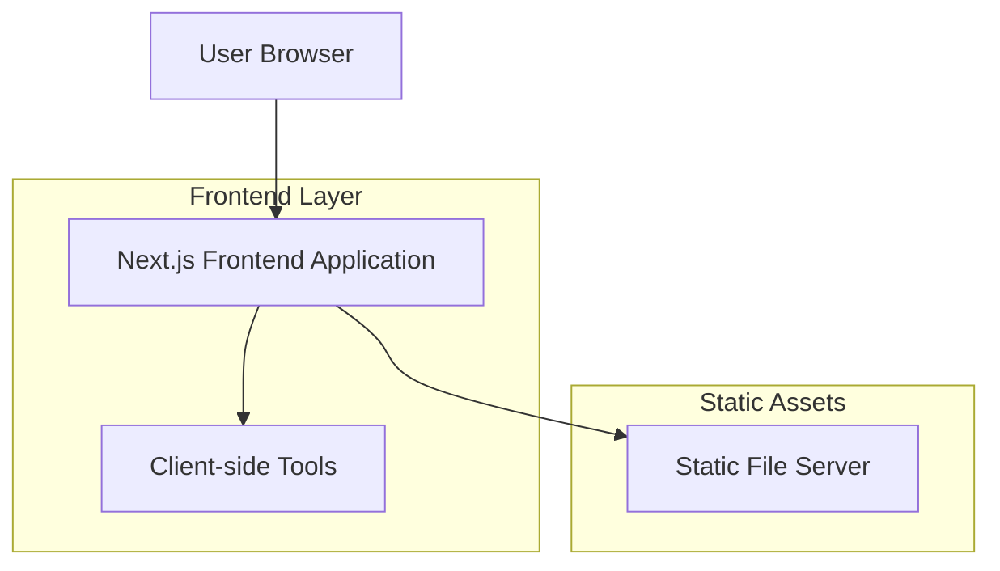
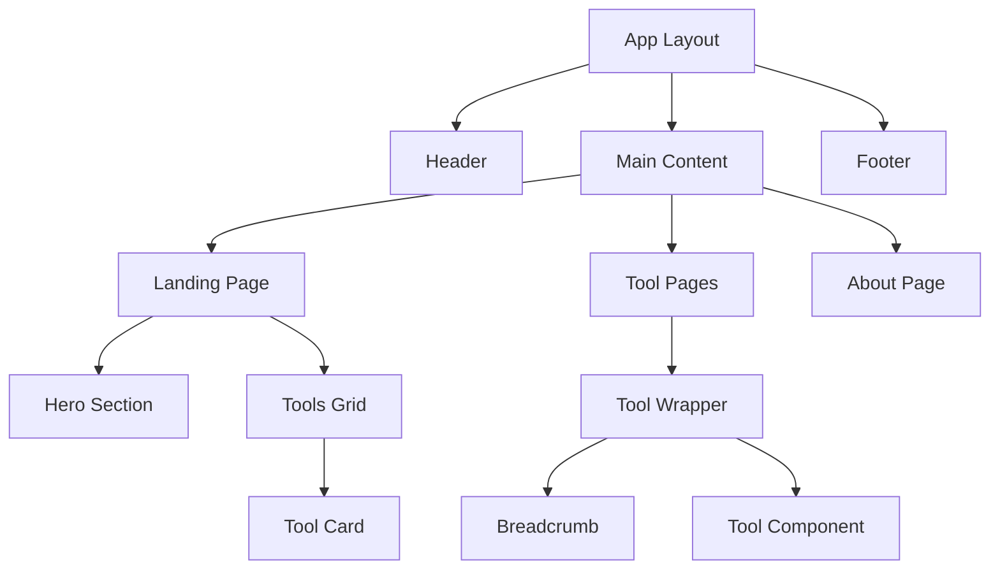

## 1. Architecture design



## 2. Technology Description

* Frontend: Next.js\@14 + React\@18 + TypeScript + Tailwind CSS + shadcn/ui

* Build Tool: Next.js built-in bundler

* Deployment: Static export (client-side only)

## 3. Route definitions

| Route              | Purpose                                                |
| ------------------ | ------------------------------------------------------ |
| /                  | Landing page, hiển thị danh sách tools và hero section |
| /tools/\[toolName] | Dynamic route cho từng tool riêng biệt                 |
| /about             | Trang thông tin về platform                            |

## 4. Project Structure

```
webtools/
├── src/
│   ├── app/
│   │   ├── layout.tsx              # Root layout với theme provider
│   │   ├── page.tsx                # Landing page
│   │   ├── about/
│   │   │   └── page.tsx            # About page
│   │   └── tools/
│   │       └── [toolName]/
│   │           └── page.tsx        # Dynamic tool page
│   ├── components/
│   │   ├── ui/                     # shadcn/ui components
│   │   ├── layout/
│   │   │   ├── Header.tsx          # Navigation header
│   │   │   ├── Footer.tsx          # Footer component
│   │   │   └── ThemeToggle.tsx     # Dark/light mode toggle
│   │   ├── landing/
│   │   │   ├── HeroSection.tsx     # Hero section component
│   │   │   └── ToolsGrid.tsx       # Tools listing grid
│   │   └── tools/
│   │       └── ToolWrapper.tsx     # Wrapper cho tool pages
│   ├── tools/
│   │   ├── calculator/
│   │   │   ├── index.tsx           # Calculator tool component
│   │   │   ├── Calculator.tsx      # Main calculator logic
│   │   │   └── types.ts            # Calculator types
│   │   ├── text-formatter/
│   │   │   ├── index.tsx           # Text formatter tool
│   │   │   ├── TextFormatter.tsx   # Main formatter logic
│   │   │   └── types.ts            # Formatter types
│   │   └── index.ts                # Tools registry và metadata
│   ├── lib/
│   │   ├── utils.ts                # Utility functions
│   │   └── tools-config.ts         # Tools configuration
│   └── types/
│       └── tools.ts                # Global tool types
├── public/
│   ├── icons/                      # Tool icons
│   └── images/                     # Static images
├── components.json                 # shadcn/ui config
├── tailwind.config.js              # Tailwind configuration
├── next.config.js                  # Next.js configuration
└── package.json
```

## 5. Component Architecture



## 6. Data model

### 6.1 Tool Configuration Schema

```typescript
interface ToolConfig {
  id: string;
  name: string;
  description: string;
  icon: string;
  category: string;
  path: string;
  component: React.ComponentType;
}

interface ToolCategory {
  id: string;
  name: string;
  description: string;
  tools: ToolConfig[];
}
```

### 6.2 Tools Registry Structure

```typescript
// src/tools/index.ts
export const TOOLS_REGISTRY: ToolConfig[] = [
  {
    id: 'calculator',
    name: 'Calculator',
    description: 'Máy tính đơn giản với các phép toán cơ bản',
    icon: 'Calculator',
    category: 'utilities',
    path: '/tools/calculator',
    component: lazy(() => import('./calculator'))
  },
  {
    id: 'text-formatter',
    name: 'Text Formatter',
    description: 'Định dạng và chỉnh sửa văn bản',
    icon: 'FileText',
    category: 'text',
    path: '/tools/text-formatter',
    component: lazy(() => import('./text-formatter'))
  }
];

export const TOOL_CATEGORIES: ToolCategory[] = [
  {
    id: 'utilities',
    name: 'Tiện ích',
    description: 'Các công cụ tiện ích hàng ngày',
    tools: TOOLS_REGISTRY.filter(tool => tool.category === 'utilities')
  },
  {
    id: 'text',
    name: 'Văn bản',
    description: 'Công cụ xử lý văn bản',
    tools: TOOLS_REGISTRY.filter(tool => tool.category === 'text')
  }
];
```

## 7. Styling Architecture

### 7.1 Theme Configuration

```typescript
// tailwind.config.js theme extension
theme: {
  extend: {
    colors: {
      border: "hsl(var(--border))",
      background: "hsl(var(--background))",
      foreground: "hsl(var(--foreground))",
      primary: {
        DEFAULT: "hsl(var(--primary))",
        foreground: "hsl(var(--primary-foreground))",
      },
      // shadcn/ui color system
    }
  }
}
```

### 7.2 Component Styling Strategy

* Sử dụng shadcn/ui components làm base

* Custom styling thông qua Tailwind CSS classes

* CSS variables cho theme switching

* Responsive design với Tailwind breakpoints

