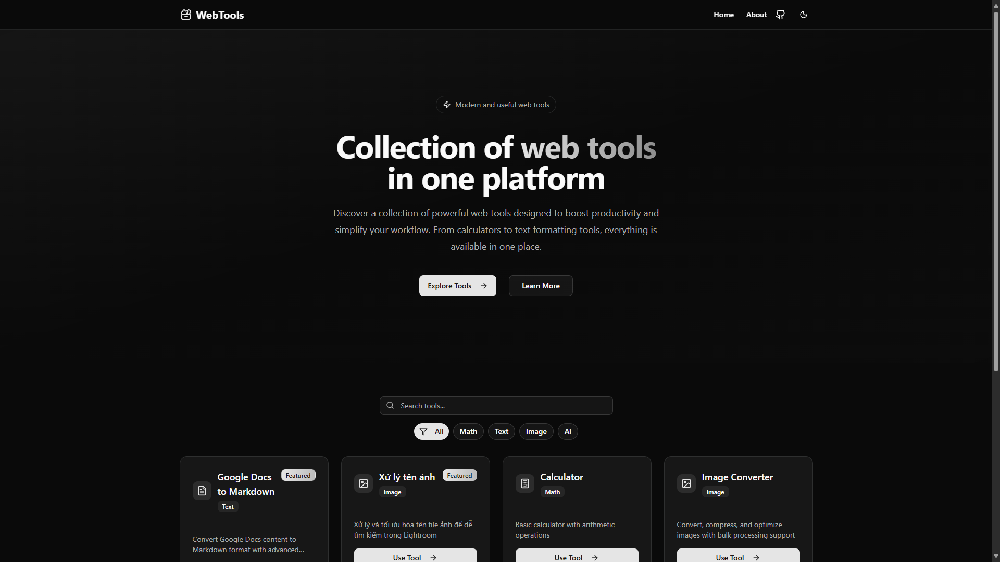

<div align="center">

# 🛠️ WebTools
### *Online Utility Tools Collection*

[](https://nextjs.org/)
[](https://bun.sh/)
[](https://hub.docker.com/r/tatsuyakari/webtools)
[](https://www.typescriptlang.org/)

*A modern web application providing comprehensive utility tools to streamline your daily workflow*



</div>

---

## ✨ Features Overview

<table>
<tr>
<td width="50%">

### 🧮 **Calculator**
- Scientific calculations
- Unit conversions
- Programmer modes (Hex, Binary, Octal)
- History tracking

### 🖼️ **Image Tools**
- **Image Converter** - Format conversion & compression
- **Image Name Processor** ⭐ *Featured*
- **OCR** - Text extraction from images

</td>
<td width="50%">

### 📝 **Text Processing**
- **Text Formatter** - Advanced text manipulation
- **Google Docs to Markdown** - Document conversion

### 🚀 **Performance**
- Built with Next.js 14 & Bun
- Docker-ready deployment
- Responsive design
- Fast & lightweight

</td>
</tr>
</table>

---

## 📸 Tool Showcase

<div align="center">

### 🧮 Scientific Calculator


*Full-featured scientific calculator with unit conversion and programmer modes*

---

### 🖼️ Image Converter


*Professional image conversion with compression and detailed statistics*

---

### 📄 Google Docs to Markdown


*Seamlessly convert Google Docs to clean, formatted Markdown*

</div>

## 🐳 Docker Deployment

This project uses Docker for easy deployment. The primary configuration is available on Docker Hub and can be built from the `Dockerfile` in the root directory.

### Docker Hub Image

The image is available on Docker Hub as `tatsuyakari/webtools:latest`. It's designed for compatibility, automatically detecting and using `bun`, `pnpm`, `yarn`, or `npm`.

- **Registry**: [tatsuyakari/webtools](https://hub.docker.com/r/tatsuyakari/webtools)
- **Base**: `node:22-alpine`
- **Pull Command**:
  ```bash
  docker pull tatsuyakari/webtools:latest
  ```

### Quick Start with Docker

```bash
# Run the image from Docker Hub, mapping host port 5005 to container port 3000
# Remember to provide your GOOGLE_API_KEY if needed
docker run -d -p 5005:3000 --name webtools-app -e GOOGLE_API_KEY="YOUR_API_KEY" tatsuyakari/webtools:latest

# Access the application
open http://localhost:5005
```

### Building Locally

If you need to build the image yourself:

```bash
# 1. Build the image from the Dockerfile
docker build -t webtools:local .

# 2. Run the locally built image
docker run -d -p 5005:3000 --name webtools-app-local webtools:local

# Access the application
open http://localhost:5005
```

### Docker Compose (Recommended for Development)

The `docker-compose.yml` file is configured to run the `tatsuyakari/webtools:latest` image and provides a convenient way to manage the application container.

**`docker-compose.yml` Configuration:**
```yaml
services:
  webtools:
    image: tatsuyakari/webtools:latest
    container_name: webtools-fullstack-app
    restart: unless-stopped
    ports:
      - "5005:3000"
    environment:
      - GOOGLE_API_KEY=${GOOGLE_API_KEY}
      - NEXT_TELEMETRY_DISABLED=1
    networks:
      - webtools-network
    healthcheck:
      test: ["CMD", "wget", "--no-verbose", "--tries=1", "--spider", "http://localhost:3000"]
      interval: 30s
      timeout: 10s
      retries: 3
      start_period: 40s

networks:
  webtools-network:
    driver: bridge
```

**Usage:**
```bash
# Create a .env file from the example
cp .env.example .env
# Add your GOOGLE_API_KEY to the .env file

# Start with Docker Compose
docker-compose up -d

# Pull the latest image and restart
docker-compose pull && docker-compose up -d --force-recreate

# Stop and remove containers
docker-compose down
```

## 🏗️ Project Structure

```
src/
├── app/
│   ├── tools/
│   │   └── [toolId]/
│   │       └── page.tsx          # Dynamic routing for tools
│   └── ...
├── components/
│   ├── landing/
│   │   └── ToolsGrid.tsx          # Displays the list of tools
│   └── ui/                        # Shadcn/ui components
├── lib/
│   └── tools-registry.ts          # Tool registration and management
└── tools/
    ├── calculator/
    ├── image-converter/
    └── ...                        # Each tool in its own directory
```

## 🚀 Adding New Tools Guide

Follow these steps to add a new tool to the WebTools collection.

### Step 1: Create the Tool Component
Create a new directory for your tool inside `src/tools/`. For example, for a tool named "My Awesome Tool":
`src/tools/my-awesome-tool/MyAwesomeTool.tsx`

### Step 2: Register Your Tool
Open `/src/lib/tools-registry.ts` and add a new entry to the `toolsRegistry` array.

```typescript
// src/lib/tools-registry.ts
import { YourLucideIcon } from 'lucide-react';

export const toolsRegistry: Tool[] = [
  // ... other tools
  {
    id: 'my-awesome-tool',
    name: 'My Awesome Tool',
    description: 'A short and clear description of what the tool does.',
    category: 'Utility',
    icon: YourLucideIcon,
    path: '/tools/my-awesome-tool',
    featured: false,
  },
];
```

### Step 3: Add the Tool to the Router
Open `/src/app/tools/[toolId]/page.tsx`, import your new tool, and add a new `case` to the `switch` statement inside the `renderTool` function.

```tsx
// src/app/tools/[toolId]/page.tsx
import MyAwesomeTool from '@/tools/my-awesome-tool/MyAwesomeTool';
// ... other imports

const renderTool = () => {
  switch (toolId) {
    // ... other cases
    case 'my-awesome-tool':
      return <MyAwesomeTool />;
    default:
      return <ComingSoonTool tool={tool} />;
  }
};
```

## 🔧 Development

This project uses **Bun** as the package manager and runtime.

### Install Dependencies
```bash
bun install
```

### Run Development Server
```bash
bun run dev
```

### Build and Check
```bash
bun run build
bun run lint
```

### Add Shadcn/ui Components
```bash
bunx shadcn-ui@latest add [component-name]
```

## 📦 Deployment Options

<table>
<tr>
<td width="50%">

### 🚀 **Vercel (Recommended)**
```bash
# 1. Push to GitHub
git push origin main

# 2. Connect with Vercel
# Auto-deployment enabled
```

### 🏗️ **Manual Build**
```bash
bun run build
bun start
```

</td>
<td width="50%">

### 🐳 **Docker Hub**
```bash
docker pull tatsuyakari/webtools:latest
docker run -p 5005:3000 tatsuyakari/webtools
```

### 🔧 **Local Development**
```bash
bun install
bun run dev
```

</td>
</tr>
</table>

---

## 🤝 Contributing

<div align="center">

### We welcome contributions! 🎉

</div>

| Step | Action | Description |
|------|--------|-------------|
| 1️⃣ | **Fork** | Fork this repository to your GitHub |
| 2️⃣ | **Branch** | Create a feature branch (`git checkout -b feature/amazing-tool`) |
| 3️⃣ | **Develop** | Implement your tool following our patterns |
| 4️⃣ | **Test** | Ensure everything works perfectly |
| 5️⃣ | **PR** | Submit a pull request with detailed description |

---

## 🔧 Technical Details

<details>
<summary><strong>🐳 Docker Image Optimization</strong></summary>

### Multi-Stage Build Process

Our Docker image is highly optimized using a sophisticated multi-stage build:

**🏗️ Stage 1 - Dependencies**
- Base: `oven/bun:1-alpine`
- Installs production dependencies
- Leverages Bun's speed

**🔨 Stage 2 - Builder**
- Copies source code
- Builds Next.js application
- Creates standalone output

**🚀 Stage 3 - Runner**
- Base: `alpine:3.19` (minimal)
- Node.js runtime only
- Non-root user security
- Optimized file structure

### Key Benefits
- ⚡ **Fast builds** with Bun runtime
- 🪶 **Lightweight** Alpine base
- 🔒 **Secure** non-root execution
- 📦 **Minimal** standalone output
- 🎯 **Production-ready** optimization

</details>

---

<div align="center">

### 🌟 **WebTools** - *Streamlining your digital workflow* 🌟

[](https://github.com)
[](https://hub.docker.com/r/tatsuyakari/webtools)

*Built with ❤️ using Next.js, Bun, and modern web technologies*

</div>
